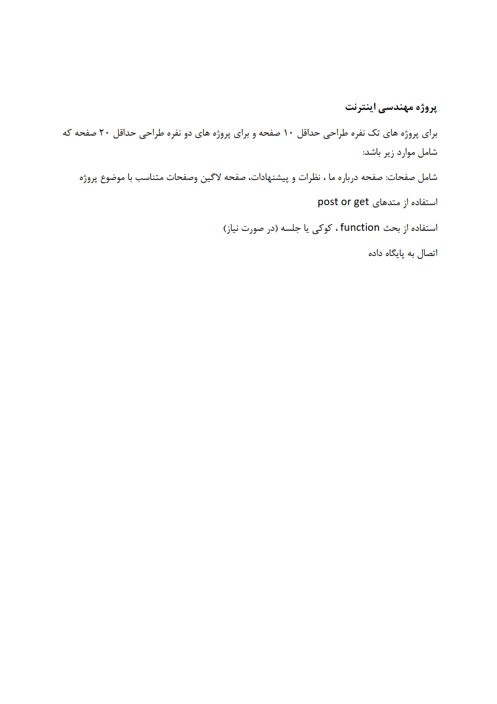

# **🐘 Internet Engineering Website Projects | پروژه‌های وب‌سایت مهندسی اینترنت**

**Several university projects where educational and store websites are designed in PHP.**

**چندین پروژه دانشگاهی که در آن وب‌سایت‌های آموزشی و فروشگاهی به زبان PHP طراحی شده‌اند.**

# 💬 **نکات پروژه**

* عکس‌های برنامه در دایرکتوری ScreenShots قرار دارند.
* برای اجرا برنامه، به برنامه‌های زیر نیاز دارید:

XAMPP v3.3.0

PHP/MySQLnd 8.2.4

Apache 2.4.56

MariaDB 10.4.28
* برای دسترسی به همه‌ی پروژه‌های دانشگاهی من، به این لینک مراجعه کنید:

👈🏻 **[پروژه‌های دانشگاهی من](https://github.com/bestmahdi2/Uni__Bachelors_SKU_Path)**

# 📝 **توضیحات پروژه**

# 🖼 **عکس‌های پروژه**

  
  
  
  
  

  

  

  

  

  

  
  
  
  
  
  
  
  
  
  
  
  
  

